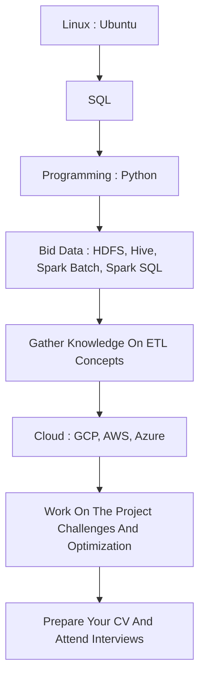

# Big Data Engineering 

### Road Map For The Big Data Engineering.

### How we will use the data?
   - Store
   - Process

### What are the Big Data problems ?
   - Volume
   - Velocity
   - Veraity
   - Value
   - Processing
 ###### The above 4 is the 4 V's problems in the big data.

### Data Layers
   - Data Storage
   - Data Processing / Analysing
   - Data Analytics
   - Data Scheduling
   - Data Testing
   - Data Pipeline
